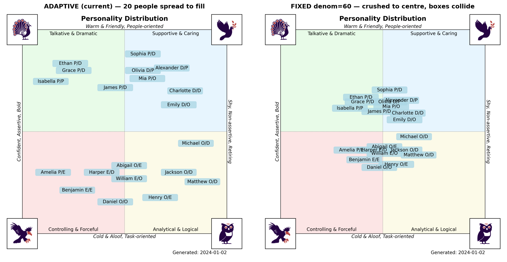
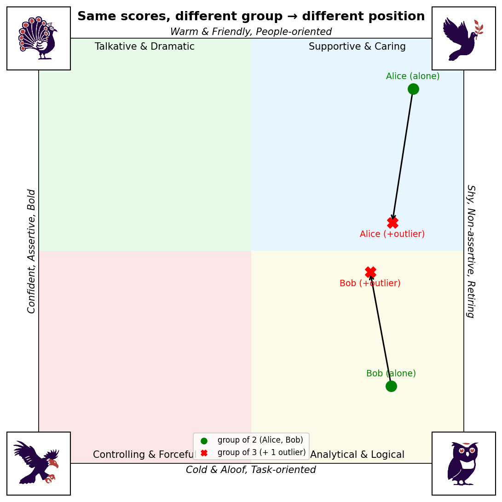

# Design Notes

## Coordinate scaling for the scatter plot

### How a person is placed

Each person's raw position on the quadrant chart is derived from their four
scores (after the dominant-bird boost below):

```
X = (Dove + Owl)     − (Peacock + Eagle)     # horizontal
Y = (Peacock + Dove) − (Eagle   + Owl)       # vertical
```

- **X** (horizontal): left = *Confident / Assertive / Bold*, right = *Shy / Non-assertive*.
- **Y** (vertical): top = *Warm & Friendly, People-oriented*, bottom = *Cold & Aloof, Task-oriented*.

This matches the bird corners: Dove (top-right) and Owl (bottom-right) pull right;
Peacock (top-left) and Dove (top-right) pull up.

### Dominant-bird boost

Before computing X/Y, each row's single highest score is multiplied by **1.2**
(if several birds tie for the max, all of them are boosted). This slightly
exaggerates a person's dominant trait so it reads clearly on the chart.

### Adaptive (per-cohort) normalization — the design choice

The raw X/Y are then squashed with `tanh`, normalized by the **largest absolute
value present in the current dataset** (see `_sigmoid_scale` in
[`bird_plot/cli.py`](../bird_plot/cli.py)):

```python
position = max_value * tanh(raw / max_abs_raw_in_this_csv)
```

This is **intentional**. Normalizing by the cohort's own extreme stretches
whatever group you load to fill the quadrant space, so the name boxes fan out
and stay readable. With a fixed/global denominator the same group collapses
into a central clump where the labels collide:



*Left — current adaptive scaling: 20 people fan out across roughly ±18–19 of the
±25 canvas. Right — a fixed denominator of 60: the same people are crushed into
±8–10 and the labels overlap.*

### The trade-off

Because the denominator is the cohort's own extreme, **positions are relative to
the group, not absolute**. The same person plotted in a different file lands in a
different spot, and a single lopsided outlier pulls everyone else toward the
centre:



*Identical Alice and Bob scores in both runs. Adding one Dove-heavy outlier
raised the Y denominator from 4 to 30, collapsing Alice and Bob toward the centre
line even though their own scores never changed.*

### Why this is the right call here

bird-plot visualizes **one team / workshop at a time**. The goal is to see how
that group spreads out relative to each other — not to compare absolute
coordinates across separate sessions. Within-cohort readability wins, so the
adaptive denominator is kept.

If you ever need cross-file comparability instead, switch `_sigmoid_scale` to a
fixed denominator — accepting the central clustering shown above.
